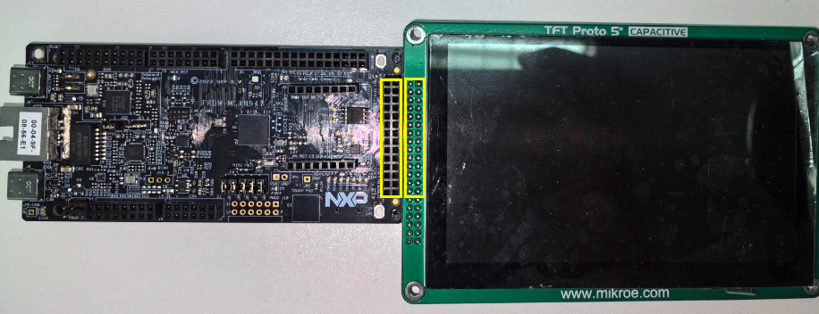
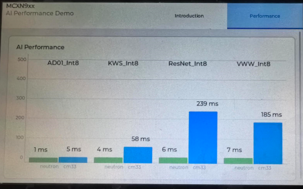

# NXP Application Code Hub

## MCXN947 NPU vs Tensorflm Benchmark

This demo is based on [MLPerf™ Tiny Deep Learning Benchmarks for Embedded Devices](https://github.com/mlcommons/tiny), it shows the performance benchmark between NPU and TensorFLM. 
Real time results are displayed on TFT LCD, On-chip NPU accelerates AI/ML algorithms and improves the performance.
Please note that this result is not verified by MLCommons Association.

|       Use Case       |                   Description                   |       Cortex-M33 Inference time       |    NPU Inference time   |    CM33 / NPU ratio    |
|----------------------|-------------------------------------------------|---------------------------------------|-------------------------|------------------------|
|   Anomaly Detection  | Detecting anomalies in machine operating sounds |              9.452ms                  |       4.174ms           |          2.26          |
|   Keyword Spotting   |        Small vocabulary keyword spotting        |              67.794ms                 |       7.164ms           |          9.46          |
| Image Classification |            Small image classification           |              247.253ms                |       10.6ms            |         23.33          |
|   Visual Wake Words  |           Binary image classification           |              218.563ms                |       10.169ms          |         21.49          |

>**Note**: Unverified MLPerf® Tiny v1.0. Result not verified by MLCommons Association. The MLPerf name and logo are registered and unregistered trademarks of MLCommons Association in the United States and other countries. All rights reserved. Unauthorized use strictly prohibited. See www.mlcommons.org for more information. 

#### Boards: FRDM-MCXN947
#### Categories: AI/ML, Graphics
#### Peripherals: DISPLAY
#### Toolchains: MCUXpresso IDE

## Table of Contents
1. [Software](#step1)
2. [Hardware](#step2)
3. [Setup](#step3)
4. [Results](#step4)
5. [FAQs](#step5) 
6. [Support](#step6)
7. [Release Notes](#step7)

## 1. Software
* [MCUXpresso IDE V11.9.0 or later](https://www.nxp.com/design/design-center/software/development-software/mcuxpresso-software-and-tools-/mcuxpresso-integrated-development-environment-ide:MCUXpresso-IDE).
* SDK_2_14_0_FRDM-MCXN947
* MCUXpresso for Visual Studio Code: This example supports MCUXpresso for Visual Studio Code, for more information about how to use Visual Studio Code please refer [here](https://www.nxp.com/design/training/getting-started-with-mcuxpresso-for-visual-studio-code:TIP-GETTING-STARTED-WITH-MCUXPRESSO-FOR-VS-CODE).

## 2. Hardware
* Board: FRDM-MCXN947
* LCD module: [Mikroe TFT PROTO 5" Capacitive](https://www.mikroe.com/tft-proto-5-capacitive-board)
* Type-C USB cable
* Personal Computer

## 3. Setup

### 3.1 Step 1
Connect the LCD to the FRDM-MCXN947, as shown below:  

### 3.2 Step 2
* Import the project to MCUXpresso IDE.
1. Open MCUXpresso IDE, in the Quick Start Panel, choose **Import from Application Code Hub** 

	

2. Enter the demo name in the search bar.

	 

3. Click **Copy GitHub link**, MCUXpresso IDE will automatically retrieve project attributes, then click **Next>**.

	

4. Select **main** branch and then click **Next>**, Select the MCUXpresso project, click **Finish** button to complete import.

	

* Compile and download to the board. 
  * *For better performance, we can change the "build configuration" from "Debug" to "Release"*.
* Reset and run.

## 4. Results
The benchmark will be shown in the screen:  
  
>**Note**: Unverified MLPerf® Tiny v1.0. Result not verified by MLCommons Association. The MLPerf name and logo are registered and unregistered trademarks of MLCommons Association in the United States and other countries. All rights reserved. Unauthorized use strictly prohibited. See www.mlcommons.org for more information.   

It displays inference time, with the green bar indicating the time used by MCXN947 NPU and the blue bar indicating the time used for pure software(TensorFlow Lite Micro) calculations. Through the GUI, it can be visually seen that NPU has taken shorter time, resulting in better performance.

## 5. FAQs
No FAQs have been identified for this project.

## 6. Support

#### Project Metadata
<!----- Boards ----->

<!----- Categories ----->
 

<!----- Peripherals ----->

<!----- Toolchains ----->

Questions regarding the content/correctness of this example can be entered as Issues within this GitHub repository.

>**Warning**: For more general technical questions regarding NXP Microcontrollers and the difference in expected funcionality, enter your questions on the [NXP Community Forum](https://community.nxp.com/)

## 7. Release Notes
| Version | Description / Update                           | Date                        |
|:-------:|------------------------------------------------|----------------------------:|
| 1.0     | Initial release on Application Code Hub        | January 30th 2024 |

